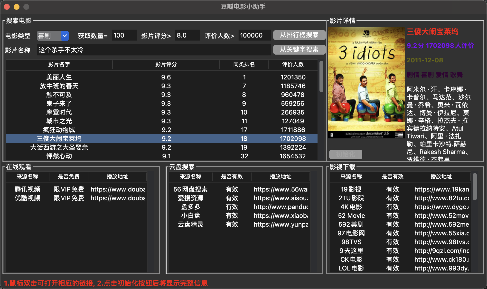

# douban_movies



## 使用方法
1、打开Chrome浏览器，在网址栏输入chrome://version/查询当前Chrome版本


2、打开<http://chromedriver.storage.googleapis.com/index.html>，下载对应版本的chromedriver驱动，下载完成后务必解压

3、打开当前目录下的文件getMovieInRankingList.py，定位到第107行，将executable_path=./chromedriver.exe修改为你的chromedriver驱动路径

4、安装程序所需的依赖包
Pillow
selenium

5、执行命令python main.py运行程序
* 报错：import _tkinter # If this fails your Python may not be configured for Tk
ModuleNotFoundError: No module named '_tkinter'
```
# 解决方法（MacOS）
brew install tcl-tk
brew install python-tk
```

* 关键词搜索时报错，chromedriver无法使用
```
#删除chromedriver的隔离性
xattr -d com.apple.quarantine ./chromedriver

#对chromedriver添加许可
spctl --add --label 'Approved' ./chromedriver

//问题依旧存在，可能是版本不一致导致，但是在网站中没有找到匹配的版本
```

项目来源：<https://github.com/shengqiangzhang/examples-of-web-crawlers/tree/master/6.%E7%88%AC%E5%8F%96%E8%B1%86%E7%93%A3%E6%8E%92%E8%A1%8C%E6%A6%9C%E7%94%B5%E5%BD%B1%E6%95%B0%E6%8D%AE(%E5%90%ABGUI%E7%95%8C%E9%9D%A2%E7%89%88)>
